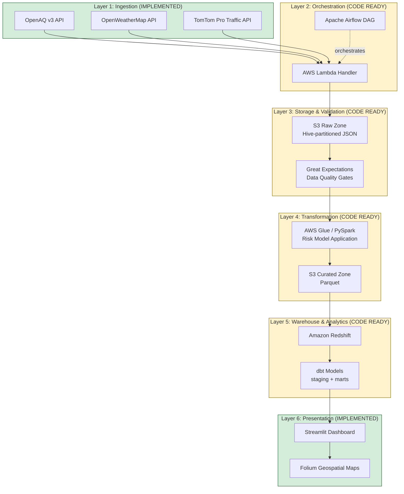

# Aero Shield v1.8 — National Air Intelligence & Bio-Metric Engine

> Environmental health intelligence platform that quantifies outdoor-worker PM2.5 exposure risk across urban India, and models the life-saving impact of wearable filtration hardware.

[]()
[]()
[]()

---

## Project history (please read first)

This project has a longer history than the GitHub commit log suggests, and I want to be straightforward about that up front so the timeline doesn't read as a red flag.

**Aero Shield started as a hardware exploration in 2024-2025** — a wearable air-filtration prototype for outdoor workers in polluted urban environments. That hardware effort didn't reach a finished prototype, but the underlying research was substantial: PM2.5 exposure modeling for outdoor occupations, Berkeley Earth's cigarette-equivalence methodology, urban canyon physics for street-level pollution amplification, and the cost-benefit analytics that would justify a wearable product for the people most exposed.

**The data platform in this repository is the analytics layer of that work, recast as a production data engineering project in late 2025 / early 2026.** I designed the architecture (six layers, Lambda → S3 → validation → Glue → Redshift → dbt → Streamlit), built the OWPEI scoring framework, and wrote the biomedical impact math (cigarette equivalence, stagnation penalty, filter efficiency calculations) over several months working locally. The Streamlit dashboard, the Folium maps, and the analysis notebook were the first pieces I shipped — those are what I used to test the math and the user experience while iterating.

**The AWS pipeline code (Lambda handler, Airflow DAG, Great Expectations suite, Glue/PySpark transformation, dbt project, AWS SAM template) was written through that period as well, but I didn't push it to a public GitHub repository until April 2026.** I worked locally with the project private until the architecture was defensible and the documentation was thorough. The single big push you see in the commit history reflects that consolidation moment, not a single sprint of work.

**The work is mine, built with heavy AI-assisted development.** I designed the architecture, wrote the core business logic, made the technology choices, and own every line. AI tooling (primarily Claude) accelerated the boilerplate — SAM template syntax, docstring formatting, test scaffolding, dbt YAML configuration — that I would have written more slowly alone. I read every line that's here, understand the tradeoffs I made, and can defend the architecture in technical conversation. The ["Known Limitations & Architectural Tradeoffs"](#known-limitations--architectural-tradeoffs) section below documents the real engineering judgment calls explicitly.

If anything about the timeline or the AI-assisted development approach raises questions, please ask directly during a screen — I'd much rather have an honest conversation about it than have it be an unaddressed concern.

---

## What this project does

Aero Shield ingests **three live data sources** — OpenAQ v3 (air quality), OpenWeatherMap (atmospheric physics), TomTom Pro (urban traffic morphology) — and fuses them into a unified biomedical risk score. The platform's core innovation is translating raw PM2.5 concentrations into a narrative metric clinicians and non-technical stakeholders can immediately understand: **Shift Cigarette Equivalence**.

The engine ranks cities by the **Aero Shield TAM Index** (Outdoor Worker Pollution Exposure Index × Population Density), identifying the highest-ROI launch markets for wearable air filtration hardware.

### Key Output

Based on March 2026 data harvesting, the platform identified **Vikas Sadan, Gurugram** as the highest-priority launch site:

| Metric                 | Value                          |
| ---------------------- | ------------------------------ |
| Baseline Risk          | 7.85 cigarettes / 8-hour shift |
| With Aero Shield       | 5.30 cigarettes / 8-hour shift |
| Weekly prevention      | ~15.3 cigarette-equivalents    |
| Risk tier transition   | Extreme Risk → Managed Risk    |

---

## Architecture

The platform is built as a full data engineering pipeline. Current implementation status is marked on each layer.



**Legend:** Green = live & running | Yellow = production code written, awaiting AWS deployment

See [`ARCHITECTURE.md`](ARCHITECTURE.md) for the full mathematical framework and engineering rationale.

---

## Repository Structure

```
aero-shield-intelligence/
├── src/                           Core Python package
│   ├── models.py                  Pure calculation functions (100% unit-tested)
│   └── utils.py                   API fetching & data helpers
│
├── tests/                         30 passing unit tests
│   └── test_models.py             pytest suite covering all core math
│
├── notebooks/                     Interactive analysis
│   └── Urban_Pollution_Exposure_Intelligence_v2.ipynb
│
├── pipeline/                      Full AWS data engineering stack
│   ├── ingestion/                 AWS Lambda handler (scheduled API harvest → S3)
│   ├── orchestration/             Airflow DAG (end-to-end pipeline)
│   ├── validation/                Great Expectations data quality suite
│   ├── transformation/            AWS Glue / PySpark transformation job
│   └── dbt/                       dbt models (staging + marts) for Redshift
│
├── dashboard/                     Live interactive front-end
│   └── app.py                     Streamlit executive dashboard
│
├── infrastructure/                Deployment assets
│   └── template.yaml              AWS SAM infrastructure-as-code
│
├── requirements.txt               Full dependency manifest
├── .env.example                   Environment variable template
└── .gitignore                     Excludes .env, __pycache__, target/, etc.
```

---

## Quickstart

### 1. Install dependencies

```bash
git clone https://github.com/SKA1M/aero-shield-intelligence
cd aero-shield-intelligence
python -m venv venv
source venv/bin/activate  # Windows: venv\Scripts\activate
pip install -r requirements.txt
```

### 2. Configure environment

```bash
cp .env.example .env
# Edit .env and add your OpenAQ, OpenWeather, and TomTom API keys
```

### 3. Run the test suite

```bash
pytest tests/ -v
# Expected: 33 passed
```

### 4. Launch the interactive dashboard

```bash
streamlit run dashboard/app.py
```

The dashboard runs out-of-the-box in **demo mode** using synthesized plausible data — no API keys required for portfolio demonstration.

### 5. Run the analysis notebook

```bash
jupyter notebook notebooks/Urban_Pollution_Exposure_Intelligence_v2.ipynb
```

---

## The Math

### Shift Cigarette Equivalence

```
Cigarettes/shift = (Inhaled Dose × Shift Hours) / (22 µg/m³ × 24 hrs)
```

Based on Berkeley Earth research: breathing air with 22 µg/m³ PM2.5 for 24 hours is equivalent to smoking one cigarette. The Active Worker Persona uses a 25 L/min breathing rate (3× resting adult), reflecting the elevated lung intake of delivery riders, street vendors, and construction workers.

### OWPEI Composite Score

```
OWPEI = PM2.5 × stagnation_penalty × source_penalty × (street_aspect_ratio / 2)
```

- **stagnation_penalty**: 1.5 if Ventilation Index < 1000, else 1.0
- **source_penalty**: 1.3 for arterial roads (FRC1/FRC2), else 1.1
- **street_aspect_ratio**: geometric canyon factor from urban morphology

### TAM Index

```
TAM_Index = (OWPEI × Population Density) / 1000
```

All formulas are implemented in [`src/models.py`](src/models.py) and independently verified by the [`tests/test_models.py`](tests/test_models.py) suite.

---

## Engineering Highlights

- **Single source of truth** for all calculation logic (`src/models.py`), reused by the notebook, Streamlit dashboard, AWS Glue transformation, and dbt models.
- **33 unit tests** covering edge cases, boundary conditions, and known-value scenarios (including reproducing the published 7.85 cigs/shift figure for Gurugram), plus the Secrets Manager credential-loading fallback paths.
- **Deterministic data** — population density values are sourced from fixed census-derived constants, not randomly generated, so the TAM Index rankings are reproducible across runs.
- **Secure by default** — API keys loaded from environment variables via `python-dotenv`; `.env` is gitignored; `.env.example` provides the template.
- **Partitioned raw storage** — Hive-style S3 partitioning (`year=/month=/day=/hour=/`) enables efficient Athena queries and Redshift Spectrum external tables.
- **Fail-fast data quality** — Great Expectations gates prevent bad raw data from reaching the curated zone.

---

## Deployment

The AWS pipeline is defined as infrastructure-as-code in [`infrastructure/template.yaml`](infrastructure/template.yaml). Deploy with:

```bash
sam build
sam deploy --guided
```

This provisions:
- S3 raw and curated buckets
- Lambda function (with IAM role, EventBridge schedule)
- Glue job (with worker allocation)
- Redshift Data API permissions
- SNS topic for pipeline completion notifications

---

## Tech Stack

| Layer          | Technology                                |
| -------------- | ----------------------------------------- |
| Ingestion      | AWS Lambda (Python 3.12), EventBridge     |
| Orchestration  | Apache Airflow 2.9                        |
| Storage        | Amazon S3 (raw & curated zones)           |
| Validation     | Great Expectations 0.18                   |
| Transformation | AWS Glue 4.0 / PySpark                    |
| Warehouse      | Amazon Redshift                           |
| Modelling      | dbt Core 1.7 (dbt-redshift)               |
| Dashboard      | Streamlit + Folium + Plotly               |
| Testing        | pytest (33 tests covering math + credential loading) |

---

## Known Limitations & Architectural Tradeoffs

Nothing here is a bug — these are design decisions with documented tradeoffs. Calling them out honestly is part of the engineering discipline the project aims to demonstrate.

### 1. Synchronous ingestion pattern

The current Lambda handler fetches OpenAQ, then loops through each site to call OpenWeather and TomTom sequentially. For 15–25 sites this completes well within the 5-minute Lambda timeout, but the pattern doesn't scale linearly — at 100+ sites or under API latency spikes, we'd hit the timeout or per-minute rate limits.

**Production fix:** Fan out via SQS — one "discoverer" Lambda publishes site IDs to a queue, a fleet of worker Lambdas consume the queue and fetch weather/traffic per site in parallel. Deferred to v1.9; the current monolithic handler is sufficient for the platform's current scale and keeps the blast radius of the ingestion layer small.

### 2. Calculation logic exists in two places

Core biomedical formulas (cigarette equivalence, stagnation penalty, filter reduction) are implemented in both `src/models.py` (Python, applied at the Glue transformation stage) and `pipeline/dbt/models/marts/mart_worker_exposure.sql` (SQL, re-applied at the warehouse layer). This is a deliberate tradeoff:

- Glue applies the math per-row at ingestion, so the curated Parquet files contain the computed columns.
- dbt re-applies the math from raw columns so backfills, what-if analyses, and constant-tuning experiments can run in SQL without re-running Glue.

**The real DRY concern** is the _constants_ (22 µg/m³ Berkeley factor, 1.5 m³/hr breathing rate, 0.325 filter efficiency) — currently duplicated between `src/models.py` and `dbt_project.yml`. The intended fix is a single JSON config stored in S3, read at startup by both Glue and dbt (via dbt's `var()` macro hydrated from a pre-run step). Tracked on the roadmap.

### 3. Rule-based urban classifier

`src/utils.py` classifies urban morphology via keyword matching on location names (e.g., "Gurugram" → `High-Rise Business District` with SAR 3.5). This is brittle and doesn't generalise to new cities without manual code changes.

**Production fix:** Replace with OpenStreetMap building footprint integration — compute aspect ratios from actual geometry rather than inferring from names. Tracked on the roadmap. The `ARCHITECTURE.md` document flags this limitation transparently.

### 4. Population density as fixed constants

Population density values (22,000 people/km² for `Dense Residential/Commercial`, etc.) are curated fixed constants sourced from 2024 census-derived estimates, not live data. This is intentional — random sampling (the original notebook's approach) made the TAM Index non-reproducible across runs. Fixed constants are honest and deterministic, but outdated as cities grow.

**Production fix:** WorldPop or India census API integration for live density at the sensor's 1 km² grid cell.

### 5. Credential handling

API keys are now loaded via AWS Secrets Manager at Lambda cold-start (`pipeline/ingestion/lambda_handler.py::_load_credentials`), with environment-variable fallback for local testing. The Lambda IAM role is scoped to `GetSecretValue` on exactly one secret resource — no broader Secrets Manager access.

The SAM template currently accepts API keys as CloudFormation parameters for bootstrapping convenience (so `sam deploy --guided` works end-to-end). For genuine production use, remove the `OpenAQApiKey`/`WeatherApiKey`/`TomTomApiKey` parameters from `template.yaml` and populate the secret manually post-deploy via `aws secretsmanager put-secret-value`.

---

## Roadmap

- [x] Core calculation engine with unit tests
- [x] Three-API integration layer
- [x] Interactive Folium geospatial output
- [x] Streamlit executive dashboard
- [x] AWS Lambda ingestion handler
- [x] Airflow orchestration DAG
- [x] Great Expectations validation suite
- [x] AWS Glue transformation job
- [x] dbt staging + marts models
- [x] AWS Secrets Manager integration for API credentials (v1.8.1)
- [ ] Shared-config pattern for biomedical constants (single JSON in S3 read by both Glue and dbt)
- [ ] SQS fan-out refactor for parallel per-site ingestion (v1.9)
- [ ] OpenStreetMap integration for data-driven urban aspect ratios
- [ ] WorldPop API integration for live population density
- [ ] Terraform/SAM deployment validated on live AWS account
- [ ] Real-time SNS alerting when TAM Index exceeds threshold
- [ ] Historical time-series tracking and trend detection

---

## License

MIT

## Author

**Sunil Kaimootil**
[LinkedIn](https://www.linkedin.com/in/sunil-kaimootil/) | [GitHub](https://github.com/SKA1M)
